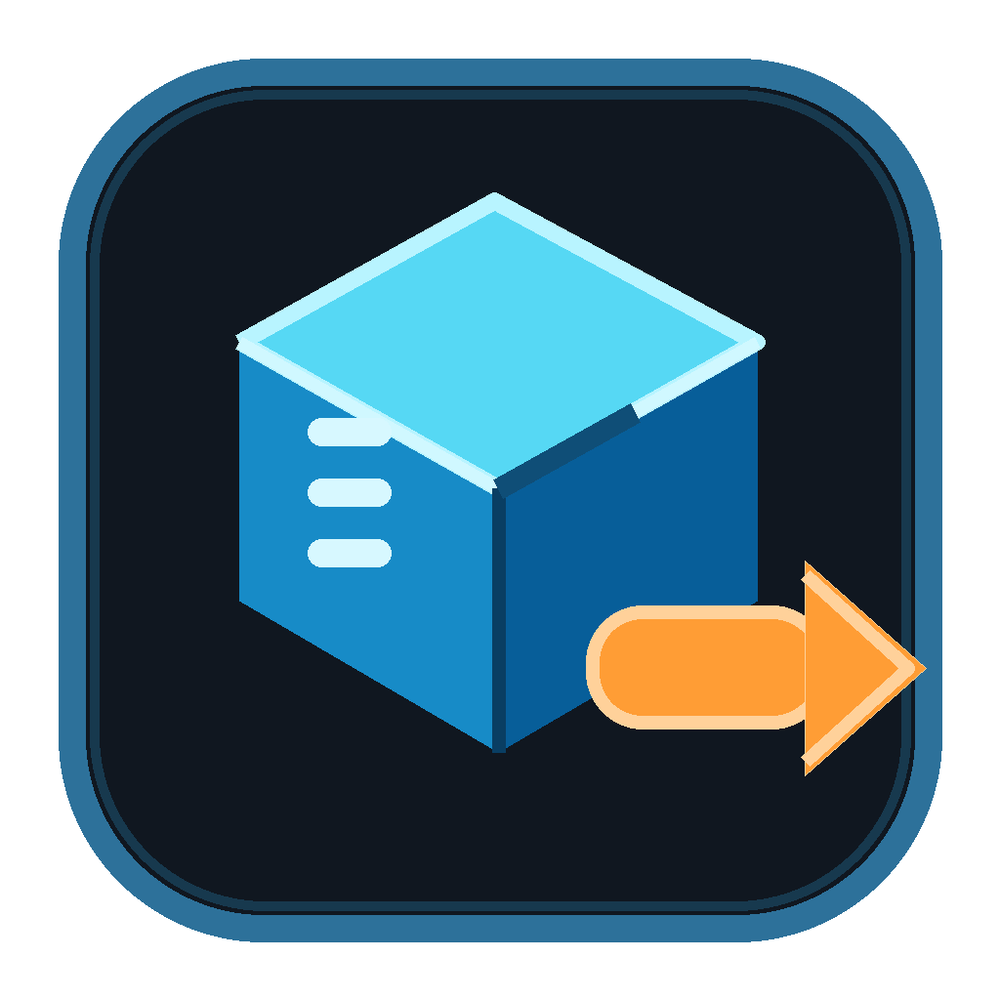

# ReExtractor



ReExtractor 是一个面向 Windows 的 RE Engine 资源工作台，用于加载游戏 PAK，配合路径 list 浏览资源，并预览、提取、组合和导出模型、贴图、骨架与动画。当前发布包为单 EXE，适合多个版本并存、直接对比和回退。

项目定位是解包、预览和导出。它不提供 Mod 编辑、PAK 重新打包或游戏资源传播服务。

## [⬇ 查看 GitHub Releases 构建包](https://github.com/PieceMetal/ReExtractor/releases)

> 请在 Releases 页面选择所需版本的 Windows x64 构建包，解压后运行唯一的 `ReExtractor-vX.Y.Z.exe`。首次启动会自动释放必要的贴图解码库，并在程序旁生成设置、日志、路径 list 和导出目录。

当前版本：`v1.3.7`

## v1.3.7 更新

- 修复《怪物猎人：荒野》等游戏直接预览或导出 TEX 时只得到 64×64 / 256×256 低清常驻贴图的问题。
- 预览、单张导出和批量导出现在会优先使用 `streaming` 路径中的全分辨率贴图；源文件为 2K / 4K 时保持原尺寸导出。
- 没有 streaming 资源的旧游戏会自动回退到普通 TEX，不影响原有贴图导出。

## v1.3.6 更新

- 发布 ZIP 仅包含一个带版本号的 EXE，不再附带工具、预设、许可证、兼容副本或原生 DLL。
- EXE 首次启动时会自动释放 GDeflate 解码库，贴图解码能力保持不变。
- v1.3.5 及之后可使用内置“检查更新”；更新脚本支持中文安装路径，并保留旧版 EXE 作为回退入口。

## v1.3.5 更新

- 修复 Windows PowerShell 5.1 将无 BOM UTF-8 更新脚本按本地代码页读取、导致中文安装路径升级失败的问题。
- 更新脚本失败时会写入 `ReExtractor-tools/logs/update.log`，不再只关闭窗口而没有可查信息。

## v1.3.4 更新

- 修复旧版“检查更新”能发现新版本、但因新包 EXE 改名而无法安装的问题。
- 发布包保留仅用于旧更新器接力的 `ReExtractor.Gui.exe` 兼容副本；正常使用请运行带版本号的 `ReExtractor-vX.Y.Z.exe`。

## v1.3.3 更新

- 发布 ZIP、解压目录、可执行文件和窗口标题均显示完整版本号，便于多版本并存和回退。
- 在线更新不再覆盖旧 EXE；会写入并启动新版本文件，保留旧版本作为回退入口。

## v1.3.2 更新

- 新增 GDeflate TEX 解压支持，修复《怪物猎人：荒野》和《怪物猎人物语 3》部分贴图无法读取、呈现噪点或显示为灰色的问题。
- 新增《怪物猎人物语 3》角色材质适配：支持 ALBR、BCLO 毛发、角色发色/眉毛色、眼睛 COLR 色层与瞳色，以及眼部折射镜片和 toon 轮廓壳过滤。
- 优化角色分件预览：合并加载可复用已解码底图，避免同一张大贴图被重复解码；加载期间锁定界面，防止切换资源导致串模型或按钮失效。
- 修复预设加载后的贴图请求状态、荒野 Steam 路径自动匹配和说明窗口 Esc 关闭。
- 在线更新会同时更新 GDeflate 原生解码库。

## v1.2.6 更新

- 修复《怪物猎人：崛起 / 曙光》部分已解包模型找不到贴图的问题：支持 MDF 资源路径的 `@` 前缀、省略 `natives/stm` 的简化目录结构，以及 `.tex.28.STM` 流式贴图文件名。

## v1.2.5 更新

- 新增直接打开已解包资源文件夹，无需 PAK 和路径 list 即可浏览、预览和导出资源，并支持拖入文件夹。
- 新增按游戏分类的模型组装预设，可保存和恢复角色分件合并队列。
- 增加《怪物猎人：荒野》流式 Mesh 数据读取，解决部分模型缺少顶点或索引数据的问题。
- 修复多分件合并时参考骨架受加载顺序影响，导致动画下肢抖动、手指或 IK/辅助骨动画丢失的问题。
- 修复模型与动画 FBX 单位不一致引起的 UE 缩放异常。
- 修复《鬼泣5》动画 FBX 缺少 Bind Pose，导致 UE 按动画首帧推断参考姿势、头部与身体分离的问题。导入动画时选择已有 Skeleton 并关闭 Import Mesh。

## v1.2.4 更新

- 修复在动画下拉框中选择动作后没有自动播放的问题；切换动作时会从第 0 帧开始播放。
- 保留手动拖动时间轴时自动暂停的行为，方便逐帧检查动作。

## v1.2.3 更新

- 修复未事先点击“加载贴图”时，导出的 FBX 只有模型、材质不引用贴图的问题；模型导出会自动读取 MDF 并将基础色贴图关联到 FBX。
- FBX 旁会生成同名 `.fbm` 贴图目录；MDF 引用的其他贴图通道继续导出到 `output/textures`。
- 修复 FBX 文件已经生成后，进度条仍长期显示导出中、导出按钮持续不可用的问题。

## v1.2.2 更新

- 资源目录树和搜索结果支持 Ctrl 追加选择、Shift 连续范围选择，并显示当前选中数量。
- 右键菜单新增批量导出选中 TEX 贴图为 PNG，保留原资源目录结构，避免同名贴图覆盖。
- 导出当前角色模型 FBX 时，自动解析所有已加载模型分件的 MDF，并导出其引用的有效 TEX 贴图，无需事先加载贴图。
- 自动跳过 NullWhite、NullBlack 等占位贴图，并在日志中记录单张导出失败。

## v1.2.1 更新

- 修复合并或右键叠加多个模型分件后播放动画不同步、身体变形的问题：改用场景中骨骼最完整的分件作为全局姿势驱动，同名骨骼复用主模型动画。
- 修复加载贴图后视口仍无贴图的问题：支持 DMC5 的 `natives/x64` 资源根、`.tex.11` 纹理版本，以及 `BaseMetalMap` / `BaseShiftMap` 材质通道。
- 修复头发远景稀疏、胡子呈灰色颗粒、眼睛无贴图等材质显示问题：毛发类（头发/胡子/眉毛/睫毛等）alpha 裁切阈值统一为 0.1；对眼球材质强制底色 alpha 为不透明并关闭 cutout；隐藏泪膜/角膜等无底色的眼部 overlay 层；无底色的睫毛改用 BaseColor 生成不透明黑色兜底。
- 修复窗口缩小后顶部工具栏向右越界、动画下拉过宽的布局问题。
- 切换到不同动画时自动从第 0 帧重新播放。

## v1.2.0 更新

- 新增类似 Unreal Engine 的骨骼树：按真实父子关系显示完整骨架，支持名称搜索、全部展开、全部折叠和双击取景。
- 选中骨骼后可查看索引、父级、子级数量、蒙皮类型、源局部位置和缩放，并在视口中以黄色高亮相邻骨骼与三轴标记。
- 骨骼树会区分蒙皮骨、非蒙皮辅助骨和导出补全 Root，便于在导出前确认最终 FBX / UE 层级。
- FBX 导出保留完整源骨架，包括不参与蒙皮的 Root；修复部分街霸 6 角色导出后 Root 丢失、人物躺倒或前向不一致的问题。
- 合并多个模型分件时会综合各分件的父子关系补全 `Root → C_Hip`，不再由首个加载分件决定最终根层级。
- 对确实没有 Root 的源骨架，模型和动画统一补充不改变静止姿势与蒙皮的真实根骨，保持 X 向右、Y 向前、Z 向上的 UE 坐标约定。
- 优化右侧模型组 / 骨骼树页签字号与间距，并启用新版应用图标。

## v1.1.1 更新

- 搜索结果右键菜单新增“在目录树中定位”，可自动清空搜索、展开完整父目录并选中对应资源。
- 改善街霸 6 等资源数量较多游戏的目录浏览体验，便于确认搜索结果所在的真实资源路径。

## v1.1.0 更新

- 新增多 MotionList 批量导出：支持在资源搜索结果中使用 Ctrl / Shift 多选，或将全部搜索结果一次加入导出队列。
- 批量导出已整合到原有“动画导出”区域，每个 MotionList 中的动画仍保持单独 FBX 输出，并显示列表、动画和总任务进度。
- 单个 MotionList 导出失败时会记录到日志并继续处理后续列表。
- 优化动画导出队列布局，明确区分添加来源、队列内容和移除操作，并显示已加入的列表数量。
- 优化模型组操作：增加可见数量提示、整行勾选，并统一恢复默认、全部显示、全部隐藏、仅显示选中组和取景选中组的布局。
- 移除左侧重复的“打开 PAK 文件”大按钮，仍可通过文件菜单、拖放 PAK 或游戏目录扫描加载。

## v1.0.0 更新

- 统一视口与导出坐标约定：X 轴向右、Y 轴向前、Z 轴向上，并让左下角世界坐标轴随镜头同步。
- 调整默认透视观察角度、全部取景居中、鼠标环绕方向及空视口操作。
- 修复资源列表部分区域无法双击或右键、右键菜单命中范围不完整的问题。
- 修复 Blender 5.x 下动画导出读取 `Action.fcurves` 导致的报错。
- 修复模型与动画 FBX 的骨骼轴向、蒙皮对应、UE 导入方向和缩放。
- 修复动画根位移被重复转换后落到负 Z、在 UE 中表现为向下移动的问题。
- 模型导出包含当前预览中的可见合并分件；动画可选择导出当前项或整个 MotionList，并保持逐动画独立输出。
- 不再预置特定游戏的路径 list，首次启动保持干净，可在列表管理器中按需下载或导入。
- 发布包精简为单个 EXE，list、设置、日志、缓存和导出目录均在运行后统一生成到程序旁。

## 主要功能

- 加载单个或多个 PAK；选择某个 PAK 时，会一并加载同目录下的其他 PAK。
- 直接打开已解包的 RE Engine 资源文件夹，支持常见 `re_chunk_* / natives` 目录布局。
- 选择游戏文件夹后自动扫描目录内全部 PAK。
- 选择路径 list 后浏览和定位资源路径；部分 list 会尝试自动匹配本机游戏目录。
- 支持 TEX 贴图预览，并可导出 PNG / DDS。
- 支持 Mesh 模型、骨架、材质、贴图和 MotionList 动画预览。
- 模型默认先快速加载几何；需要材质贴图时，可在预览区点击“加载贴图”。
- 支持多个模型分件叠加预览，也支持同骨骼模型合并预览。
- 支持播放 MotionList 动画，手动拖动进度条后会自动暂停。
- 动画时间显示包含秒数、当前帧、总帧数和源帧率。
- 支持导出当前预览模型 FBX，以及当前动画、当前 MotionList 或多个 MotionList 的全部动画 FBX。
- 动画导出按源动画速度和有效帧范围输出，避免尾部重复静止帧。
- 默认导出文件夹位于程序 EXE 同级目录，可在主界面、环境窗口和设置中直接打开。
- 首次启动会弹出环境窗口；未配置 Blender 时执行 FBX 导出也会提示配置环境。

## 当前支持状态

| 游戏 / 能力 | 状态 |
| --- | --- |
| 《鬼武者：剑之道》DEMO | 已在样本上验证 PAK、贴图、模型、骨架、动画预览与 FBX 导出工作流 |
| 《鬼武者2》 | 动画解析、预览与 FBX 导出问题尚未解决；当前不作为动画工作流已支持的游戏宣传 |
| 《街头霸王 6》 | 已在样本上验证 PAK、list、模型基础材质与贴图读取；动画仍属于实验性支持 |
| 《怪物猎人：荒野》 | 已验证 GDeflate 贴图解压、角色模型分件与基础材质预览 |
| 《怪物猎人：崛起 / 曙光》 | 已验证 PAK / 已解包资源中的模型与贴图读取、角色基础材质预览 |
| 《怪物猎人物语 3》 | 已验证 PAK、角色身体/头部/毛发分件、ALBR/BCLO 贴图与眼睛颜色层预览 |
| 其他 RE Engine 游戏 | 取决于 PAK 版本、路径 list、Mesh / TEX / MDF / MotionList 格式版本 |

新游戏并不是只更换 list 就能完整支持。PAK 解包、模型、贴图、材质和动画格式都可能需要针对真实样本适配。

## 下载与使用

1. 在 GitHub Releases 下载最新的 Windows x64 压缩包，并完整解压。
2. 将唯一的 `ReExtractor-vX.Y.Z.exe` 放在可写目录并运行；程序会在同级目录自动生成运行所需文件夹和贴图解码库。
3. 首次启动时检查环境；FBX 导出需要安装 Blender，并在设置中选择 `blender.exe`。
4. 在路径列表中选择或下载对应游戏的 list。
5. 选择游戏文件夹扫描 PAK，或直接拖入 / 打开 PAK 文件。
6. 双击资源进行预览。
7. 使用右键菜单把模型加入合并器，或把 MotionList 加入动画导出队列。
8. 使用右侧 FBX 导出面板导出模型、单个动画或批量动画。

## FBX 导出说明

- FBX 转换依赖 Blender，请在设置中选择 Blender 可执行文件。
- “导出预览模型 FBX”会导出当前预览中可见的全部模型分件。
- “导出动画 FBX”可导出当前动画、当前 MotionList 或批量列表中的全部动画；每个动画单独输出。动画 FBX 携带参考蒙皮以保存 Bind Pose，在 UE 导入时应关闭 Import Mesh。
- 单列表导出使用源动画帧率和有效帧范围；多 MotionList 批量导出统一按 60 FPS 烘焙。
- 当前 FBX 坐标约定为 X 轴向右、Y 轴向前、Z 轴向上，并已针对 Unreal Engine 的模型、骨架和根运动流程进行修正。
- 不同 RE Engine 游戏和资源版本仍可能存在特殊骨架或动画数据，导入 DCC 或 Unreal Engine 后建议进行一次抽样检查。
- RE Engine 材质不能通过 FBX 完整还原，FBX 主要用于模型、骨架和动画交换。

## 目录结构

默认导出目录位于程序 EXE 同级，其他运行数据会在首次启动后生成：

```text
ReExtractor/
├─ ReExtractor-v1.3.7.exe  # 发布包中唯一的文件
├─ libGDeflate.dll         # 首次启动后自动释放的贴图解码库
├─ output/                  # 默认导出目录
└─ ReExtractor-tools/
   ├─ filelists/            # 本地路径 list
   ├─ temp/                 # 临时文件
   ├─ data/                 # 用户设置
   ├─ logs/                 # 运行日志
   └─ tools/                # 内置转换脚本缓存
```

## 更新与版本管理

- 主菜单“检查更新…”会检测 GitHub 最新正式版；v1.3.5 起支持中文路径安装目录。
- 更新完成后会在当前目录写入新的 `ReExtractor-vX.Y.Z.exe`，不会覆盖旧版本；请按文件名中的版本号启动或回退。
- 早于 v1.3.5 的旧版不支持中文路径下的自动升级，建议手动下载并运行最新版。

## 源码构建

环境要求：

- Windows 10 / 11
- .NET SDK
- Blender，只有 FBX 导出时需要

```powershell
git clone --recurse-submodules https://github.com/PieceMetal/ReExtractor.git
cd ReExtractor
dotnet build ReExtractor.sln
dotnet run --project src/ReExtractor.Gui/ReExtractor.Gui.csproj
```

## 解析核心与更新

项目使用 [kagenocookie/RE-Engine-Lib](https://github.com/kagenocookie/RE-Engine-Lib) 作为内置解析核心。它是源码子模块，不是用户可以随意替换的 Noesis 插件。

当 CAPCOM 发布新游戏或升级资源格式时，需要先合并解析核心更新，再在本项目中完成适配和样本验证，最后随 ReExtractor 新版本整体发布。

## 第三方项目

- RE-Engine-Lib：MIT License
- Avalonia：MIT License
- Silk.NET：MIT License
- GDeflateNet：MIT License
- Blender：由用户独立安装，并遵守 Blender 自身许可证

详细信息见 [THIRD_PARTY_NOTICES.md](THIRD_PARTY_NOTICES.md)。

## 免责声明

本项目与 CAPCOM 及其关联公司无关。游戏名称、商标和资源归各自权利人所有。请仅处理你合法拥有的游戏文件，并遵守所在地法律与游戏服务条款。
